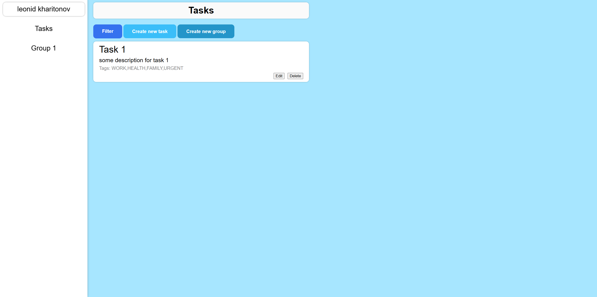
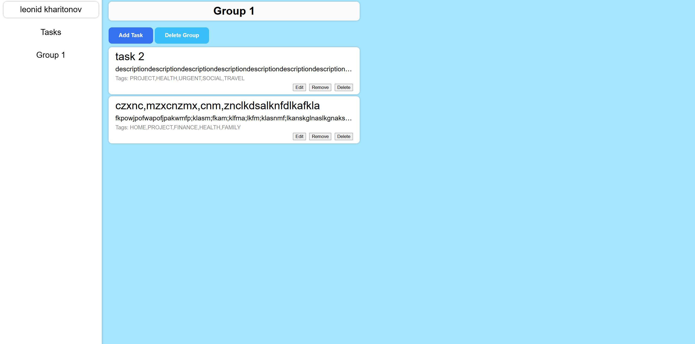
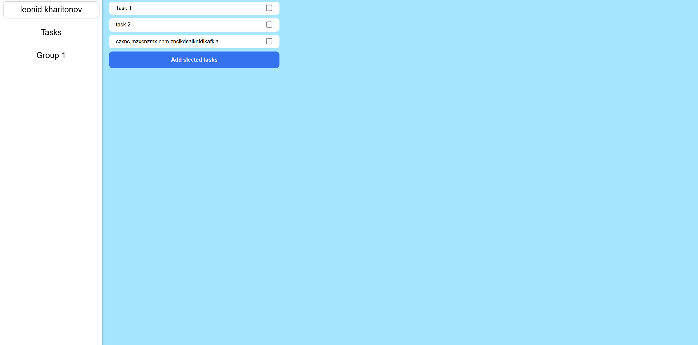

This is my first fullstack application

### Description
Taskle is TODO-list type app, it allows user to create tasks he needs, besides, you can also group them in particular groups you created

This is not something i can be proud of or brag about, but it my first application as backend delevoper, besides backend, i also have written super simple and ugly frontend using Vanilla JS, at the backend side i used Spring and Hibernate to write RESTful API that communicate with frontend

### Stack:
- String Boot
- Hibernate
- Vanilla JS
- Docker
- Liquibase
- JUnit, Mockito

### How to run:
- Download this repository
- Create file .env and fill it with variables required in _docker-compose.yml_ or just replace them in the file
- Run application with `docker compose up --build`

### Overview
Main page where you can see all your tasks and create some new or create a new group, also has a filter button which includes pagination

Group page where you can see all tasks are added in it, also can add some new tasks or delete this group

Here you can select tasks to add in particular group

